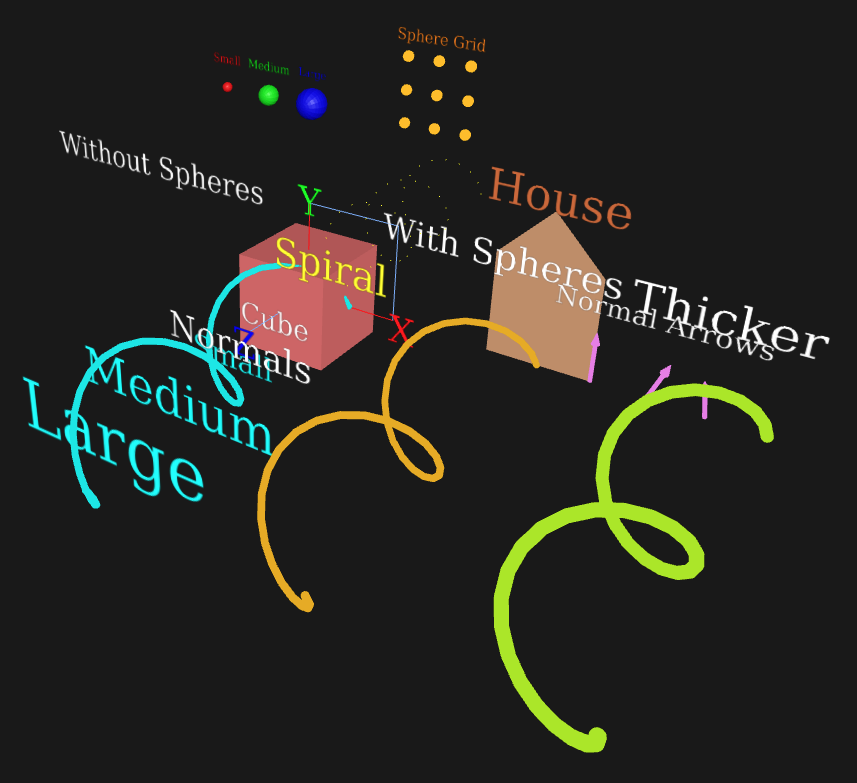

# plot2gltf

A [Claude](https://claude.ai)-created Python module to save different types of simple geometry and annotations to `glTF`. You can view the result in any GLTF viewer, such as:

- [The `<model-viewer>` tag](<https://modelviewer.dev>)
- Online viewers like <https://gltf-viewer.donmccurdy.com/>
- [Three.js](https://threejs.org)-based web viewers
- [Blender](http://blender.org)

Key features:

1. Supports multiple geometry types:
    - Triangle meshes
    - Line segments and line strips (as hairlines or cylinder tubes)
    - Points (as dots or spheres)
    - Normal vectors (as lines or arrows)
    - Text labels
2. Automatic color generation using the golden ratio for visually distinct colors
3. Optional manual color specification
4. All geometries are combined into a single GLTF file
5. Proper material setup with metallic-roughness PBR workflow

It is meant to be as easy to use as generating a 3D [matplotlib](https://matplotlib.org) plot.

## Example

```python
# Example usage:
from plot2gltf import GLTFGeometryExporter

exporter = GLTFGeometryExporter()

# Add a triangle mesh
vertices = [
    [0, 0, 0],
    [1, 0, 0],
    [0, 1, 0]
]
faces = [[0, 1, 2]]
exporter.add_triangles(vertices, faces, color=(1, 0, 0))  # Red triangles

# Add some lines
line_vertices = [
    [0, 0, 0],
    [1, 1, 1]
]
edges = [[0, 1]]
exporter.add_lines(line_vertices, edges)  # Auto-generated color

# Create a square as a line strip
points = [
    [0,0,0],
    [1,0,0],
    [1,1,0],
    [0,1,0]
]
exporter.add_linestrip(points, color=(1,0,0))  # Creates a line strip
# The same but as cylinders with sphere mitering and endcaps
exporter.add_cylinder_strips(points, color=(1,0,0), radius=0.03, add_spheres=True)

# Add labels for some points
exporter.add_text([0, 0, 0.1], "Origin", size=0.2, color=(1, 1, 1))  # White text
exporter.add_text([1, 1, 1.1], "Point 2", size=0.3)  # Auto-colored text

# Or for a curve
t = np.linspace(0, 2*np.pi, 50)
curve_points = np.column_stack([
    np.cos(t),
    np.sin(t),
    np.zeros_like(t)
])
exporter.add_linestrip(curve_points, color=(0,1,0))  # Creates a smooth curve
# The same but as cylinders with sphere mitering and endcaps
exporter.add_cylinder_strips(curve_points, color=(0,1,0), radius=0.03, add_spheres=True)

# Add points
points = [
    [0, 0, 0],
    [1, 0, 0],
    [0, 1, 0]
]
exporter.add_points(points, color=(0, 1, 0))  # Green points
# The same but as spheres
exporter.add_spheres(points, color=(0, 1, 0))  # Green points

# Add normals
normal_points = [[0, 0, 0]]
normal_directions = [[0, 0, 1]]
exporter.add_normals(normal_points, normal_directions, color=(0, 0, 1))  # Blue normals
# The same but as cylinders with cone caps
exporter.add_normal_arrows(
            normal_points, normal_directions, color=(0, 0, 1),
            shaft_radius=0.02, head_radius=0.04
        )

# Save the file
exporter.save("output.gltf")
```

## Installation

Copy `plot2gltf.py` and `fonts` into your python.

Install dependencies via:

```
pip install -r requirements.txt
```

## Demo

There is a weird, Claude-generated comprehensive demo. Run it via:

```
python demo.py
```

The output file is named `demo_scene.gltf`.

This demo file showcases:

1. Geometric Primitives:
   - Triangles (cube and house)
   - Lines (coordinate axes)
   - Points (spiral pattern)
   - Normals (orientation vectors)

2. Text Features:
   - Different sizes
   - Different colors
   - Labels for geometric objects
   - Stand-alone text examples

3. Color Usage:
   - Manual color specification
   - Automatic color generation
   - Different colors for different object types

4. Complex Shapes:
   - A cube with multiple faces
   - A spiral point cloud
   - A simple house shape
   - Coordinate axes

The scene includes a variety of objects arranged in a way that makes it easy to see all the features.



## License

Public Domain ([CC0](https://creativecommons.org/public-domain/cc0/))

The included [DejaVu font](https://dejavu-fonts.github.io) has its own (free) license.
